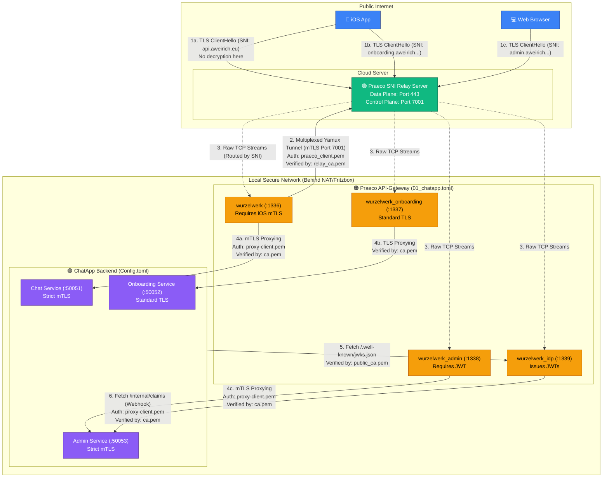

# Certificate & Trust Architecture

Dieses Dokument beschreibt die Public Key Infrastructure (PKI) und die Vertrauensketten zwischen den drei Kernkomponenten des Systems: **ChatApp Backend**, **Praeco API-Gateway** und dem **Praeco SNI Relay Server**.

---

## a) Welche Zertifikate sind abhängig und müssen übereinstimmen?

Das System ist in drei voneinander unabhängige Vertrauensbereiche (Trust Zones) unterteilt. Jeder Bereich nutzt eine eigene Certificate Authority (CA) für einen spezifischen Zweck.

### 1. Die mTLS-Brücke (Identitäts-Prüfung)
Verbindet die iOS-App, das Praeco Gateway und das ChatApp Backend über striktes Mutual TLS.
- **Root of Trust:** `ca.pem` (ChatApp)
- **Abhängigkeiten:**
  - **ChatApp (`Config.toml`):** Nutzt `ca.key`, um Zertifikate für iOS-Geräte auszustellen (Onboarding).
  - **Praeco (`01_chatapp.toml`):** Nutzt `ca.pem` (`ssl_client_ca`), um eingehende iOS-Requests zu verifizieren.
  - **Praeco Intern:** Praeco leitet Traffic an die ChatApp weiter und authentifiziert sich dabei selbst per mTLS mit `proxy-client.pem`.
  - **ChatApp Server:** Der gRPC-Server der ChatApp vertraut eingehenden Praeco-Verbindungen, da auch `proxy-client.pem` von `ca.pem` signiert wurde.

### 2. Das IdP JWT Puzzle (Token-Signierung)
Regelt, wie administrative JWT-Ausweise signiert und verifiziert werden.
- **Root of Trust:** JWKS (Dynamischer Public Key Abruf)
- **Abhängigkeiten:**
  - **Praeco IdP:** Signiert JWTs mit `idp_private.pem`.
  - **ChatApp Backend:** Verifiziert diese JWTs, indem es den öffentlichen Schlüssel über die Route `/.well-known/jwks.json` abruft (`idp_jwks_url`).
  - **TLS-Abhängigkeit:** Damit die ChatApp den IdP-Endpoint sicher per HTTPS erreichen kann, muss sie dem TLS-Zertifikat des IdPs vertrauen. (Bisher über die intern mitgelieferte `public_ca.pem` gelöst).
  - **Praeco IdP Webhook (Neu):** Der IdP ruft das ChatApp Backend unter `/internal/claims` auf, um tagesaktuelle Rollen für das JWT zu holen. Dabei authentifiziert er sich via mTLS mit dem internen `proxy-client.pem` (genau wie das Gateway), welches von der ChatApp über `ca.pem` validiert wird.

### 3. Das Relay-Tunnel Puzzle (Control Plane / Firewall-Bypass)
Sichert den Tunnel zwischen dem lokalen Praeco-Netzwerk und dem Cloud-Relay.
- **Root of Trust:** `relay_ca.pem`
- **Abhängigkeiten:**
  - **Praeco Tunnel-Client:** Nutzt `praeco_client.pem` als Ausweis und prüft den Server gegen `relay_ca.pem`.
  - **Relay Server (`RelayConfig.toml`):** Nutzt `relay_server.pem` als Ausweis und prüft eingehende Praeco-Verbindungen gegen `relay_ca.pem`.
  - Beide Endpunkt-Zertifikate **müssen** von der isolierten `relay_ca.pem` ausgestellt worden sein.

---

## b) Wie werden diese Zertifikate erzeugt?

Die Erstellung unterscheidet sich je nach Zertifikatstyp:

1. **Interne mTLS & Relay Zertifikate (`ca.pem`, `relay_ca.pem`):**
   Diese werden einmalig lokal vom Administrator (z. B. per OpenSSL oder einem Praeco-Script) generiert. Da sie das absolute Fundament der Zero-Trust Architektur bilden, sollten sie langläufig (z.B. 10 Jahre) und extrem sicher aufbewahrt werden.
2. **iOS Client-Zertifikate:**
   Diese werden **automatisch und dynamisch (on-the-fly)** vom ChatApp-Backend generiert. Die iOS-App erzeugt lokal einen privaten Schlüssel, schickt einen CSR (Certificate Signing Request) an die ChatApp, und diese signiert den CSR mit der `ca.key`.
3. **Öffentliche TLS Zertifikate (Data Plane):**
   Bisher als Self-Signed (`public_ca.pem`) erzeugt. Für die Zukunft werden diese vollautomatisch via **Let's Encrypt (ACME)** generiert.

---

## c) Was geschieht bei einem Wechsel der IP/Domain oder Umstieg auf Let's Encrypt (z. B. via Fritzbox)?

Wenn die Domäne `*.aweirich.eu` mit offiziellen Let's Encrypt Zertifikaten betrieben wird und der Traffic z.B. über eine Portfreigabe in der Fritzbox (Port 443 -> Praeco) geroutet wird, passieren wunderbare Dinge:

1. **Die internen Zertifikate bleiben unberührt!**
   Der Wechsel auf Let's Encrypt betrifft **ausschließlich** die öffentlichen Endpunkte (Data Plane im Praeco). Das komplette mTLS-System (`ca.pem`), die Client-Ausweise der iOS-App und der JWT-Key (`idp_private.pem`) bleiben absolut unangetastet. Let's Encrypt ist nur dafür zuständig, die Verbindung vom Webbrowser (z.B. Admin Dashboard) oder Smartphone zum Server vor Mitlesern zu **verschlüsseln**. Für die eigentliche **Identitätsprüfung** (Wer bist du?) ist Let's Encrypt nicht zuständig. Das macht bei der iOS-App weiterhin die mTLS-Infrastruktur (`ca.pem`) und beim Admin Dashboard weiterhin das JWT (signiert durch `idp_private.pem`).

2. **Wegfall der `public_ca.pem` Bundles:**
   Da Let's Encrypt von Haus aus als vertrauenswürdig eingestuft wird, kann im ChatApp Backend (`Config.toml`) die Eigenschaft `idp_ca_cert_path` einfach geleert werden. Der Rust `reqwest` Client vertraut Let's Encrypt nativ, sodass der JWKS-Abruf dann out-of-the-box ohne eigenes Root-Zertifikat klappt. Auch auf der iOS-Seite (`AppConfig.swift`) muss für den Let's Encrypt Betrieb kein Self-Signed Root-Zertifikat mehr manuell in den Client geladen werden (`useLocalSelfSignedCerts = false`).

3. **Dynamische IP (Fritzbox):**
   Wenn sich die öffentliche IP deiner Fritzbox ändert, muss lediglich der DynDNS-Eintrag für `aweirich.eu` aktualisiert werden. Praeco selbst ist die IP-Adresse egal (es bindet sich an `0.0.0.0`). 

4. **Wo werden die Let's Encrypt Zertifikate eingetragen?**
   Die neuen Let's Encrypt Zertifikate (meistens `fullchain.pem` und `privkey.pem` genannt) ersetzen deine bisherigen Self-Signed-Zertifikate `praeco_public.pem` und `praeco_public.key`. Du trägst die Dateipfade dazu einfach in der Praeco-Konfiguration (`01_chatapp.toml`) bei *jedem* `[[Server]]` Block im Abschnitt `[Server.server_certs]` ein:
   ```toml
   [Server.server_certs]
   ssl_certificate = "/pfad/zu/letsencrypt/fullchain.pem"
   ssl_certificate_key = "/pfad/zu/letsencrypt/privkey.pem"
   ```
   **Wichtig:** Weder der Relay-Server (`RelayConfig.toml`) noch das ChatApp Backend (`Config.toml`) bekommen diese Let's Encrypt Zertifikate! Sie werden **ausschließlich** im Praeco Gateway für den Kontakt nach außen (die "Data Plane") konfiguriert.

---

## d) Architektur-Diagramm (Datenfluss & Zertifikate)

Dieses Diagramm visualisiert, wie der Traffic vom öffentlichen Internet durch den Relay-Server in dein lokales Netzwerk fließt und wie die Zertifikate jeden Schritt absichern.


Key Certificate Mappings (The "Glue")
relay_ca.pem: The exclusive CA for the Zero-Trust Tunnel. It links the Relay Server (Port 7001) and the Praeco Gateway tunnel configurations.
ca.pem: The master internal CA. It links the iOS App (Client Certs), Praeco Gateway (Incoming mTLS + Outgoing Proxy mTLS), Praeco IdP (Outgoing Claims Webhook mTLS), and the ChatApp Backend (gRPC mTLS).
public_ca.pem: The CA used for public TLS endpoints (Port 443). The ChatApp currently uses this to trust the Praeco IdP when fetching the JWKS keys. (Will become obsolete with Let's Encrypt).
idp_private.pem & JWKS: The IdP uses the private key to sign JWTs. The ChatApp fetches the public key via JWKS to verify those JWTs.