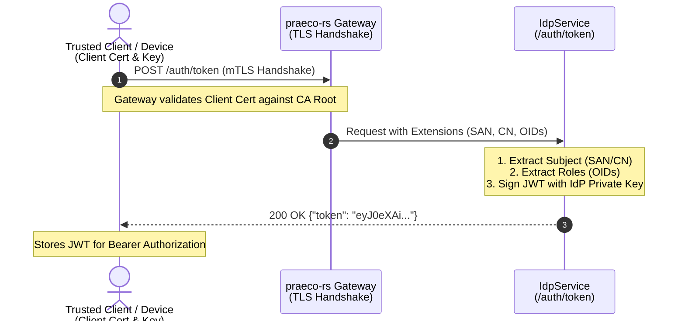
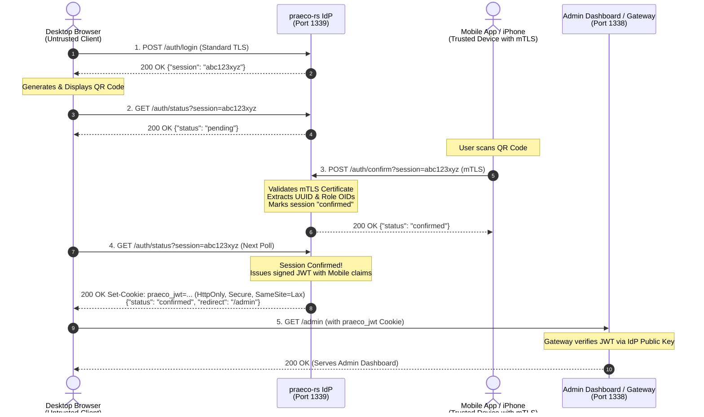
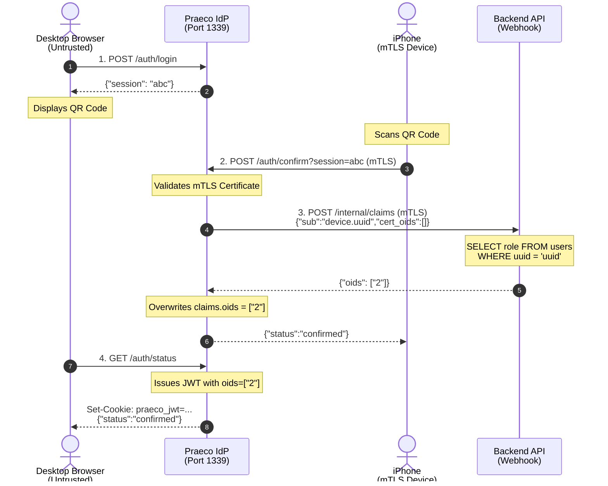

# Identity Provider (IdP) Documentation

`praeco-rs` features a built-in Identity Provider (IdP) that issues its own signed JSON Web Tokens (JWTs). Instead of relying on traditional username/password authentication, the IdP leverages **mutual TLS (mTLS)** to securely authenticate clients and issue tokens.

The IdP primarily supports two authentication flows: **Direct mTLS Authentication** for trusted devices and **Cross-Device Login (QR Code Flow)** for untrusted clients like web browsers.

## 1. Direct mTLS Authentication (Device Flow)

This flow is designed for native apps or devices that have already been provisioned with a valid client certificate (e.g., via a prior onboarding/OTP process).

**Procedure:**
1. The client makes a `POST` request to `/auth/token`, presenting its valid mTLS client certificate to the gateway.
2. The `praeco-rs` Connection Handler validates the certificate against the trusted Root CA.
3. Upon successful TLS handshake, the IdP extracts the identity claims from the certificate:
   - **Subject (`sub`)**: Extracted from the Subject Alternative Name (SAN) or the Common Name (CN) of the certificate.
   - **Roles/Permissions**: Extracted from custom Object Identifiers (OIDs) embedded in the certificate.
4. The IdP generates a JWT signed with its private key, embedding these claims.
5. The signed JWT is returned directly to the client in a JSON response (`{"token": "..."}`).
6. The client can then use this JWT in the `Authorization: Bearer <token>` header for subsequent API requests.

### Sequence Diagram


**cURL Example:**
```bash
# Request a JWT using mTLS client certificates
curl -X POST https://localhost:1339/auth/token \
  --cert client_certs/device.crt \
  --key client_certs/device.key \
  --cacert server_certs/ca.crt
```
*Expected Response:*
```json
{"token":"eyJ0eXAi...<JWT_TOKEN>..."}
```

## 2. Cross-Device Login (Browser / QR Code Flow)

This flow allows a user on an untrusted device (like a desktop web browser) to securely log in by using their trusted mobile device (which holds the mTLS certificate) to authorize the session.

**Procedure:**
1. **Session Initiation:** 
   The untrusted client (browser) makes a `POST` request to `/auth/login`. The IdP creates a temporary, short-lived session and returns a unique `session_id`.
   
2. **Display & Polling:** 
   The browser displays this `session_id` (typically rendered as a QR Code) and continuously polls the IdP via `GET /auth/status?session=<session_id>`. While unconfirmed, the IdP returns `{"status":"pending"}`.
   
3. **Session Confirmation:** 
   The user scans the QR code with their trusted mobile app. The mobile app makes a `POST` request to `/auth/confirm?session=<session_id>`. 
   Crucially, the mobile app performs this request over an **mTLS connection** using its client certificate. The IdP extracts the identity claims (Subject and OIDs) from the mobile app's certificate and attaches them to the pending session, marking it as "confirmed".
   
4. **Token Issuance:** 
   On the browser's next polling request to `GET /auth/status?session=<session_id>`, the IdP sees the session is confirmed. It generates a signed JWT containing the claims of the trusted device.
   The IdP returns the JWT to the browser in a secure `Set-Cookie` header (`HttpOnly; Secure; SameSite=Lax`) along with a redirect URL.
   
5. **Authenticated Access:** 
   The browser is now authenticated. Subsequent requests from the browser will automatically include the JWT cookie, which the gateway can validate.

### Sequence Diagram


**cURL Example / Script:**

**Step 1: Initiate Session (Untrusted Client)**
```bash
# Returns a new session_id
curl -s -X POST https://localhost:1339/auth/login
```
*Example Response:* `{"session":"abc123xyz"}`

**Step 2: Poll Session Status (Untrusted Client)**
```bash
# Polling while waiting for confirmation
curl -s "https://localhost:1339/auth/status?session=abc123xyz"
```
*Example Response:* `{"status":"pending"}`

**Step 3: Confirm Session via mTLS (Trusted Device)**
```bash
# The trusted device uses its certificate to confirm the session
curl -s -X POST "https://localhost:1339/auth/confirm?session=abc123xyz" \
  --cert client_certs/device.crt \
  --key client_certs/device.key \
  --cacert server_certs/ca.crt
```
*Example Response:* `{"status":"confirmed"}`

**Step 4: Retrieve JWT (Untrusted Client)**
```bash
# The browser polls again and receives the JWT as a Set-Cookie header
curl -s -v "https://localhost:1339/auth/status?session=abc123xyz"
```
*Example Response Headers (excerpt):*
```http
< HTTP/1.1 200 OK
< set-cookie: praeco_jwt=eyJ0eXAi...; HttpOnly; Secure; SameSite=Lax; Path=/; Max-Age=28800
< content-type: application/json

{"status":"confirmed","redirect":"/admin"}
```

## Configuration & Security

- **Session TTL:** Login sessions have a strict Time-To-Live (TTL) and expire automatically if not confirmed.
- **JWT Expiry:** Issued JWTs have a configured expiration time.
- **JWT Claims:** The IdP injects a customizable `iss` (Issuer) claim and optionally an `aud` (Audience) claim if requested by the client (via query parameter `?aud=...`) and whitelisted in the configuration.
- **Keys:** The IdP uses a configured private key (`jwt_private_key`) to sign the tokens. The corresponding public key is used by the middleware to verify incoming requests.
- **Cookie Security:** Tokens issued to browsers are protected by specific cookie flags to mitigate common web vulnerabilities:
  - **`HttpOnly` (XSS Protection):** This flag ensures that the cookie cannot be accessed via client-side scripts (e.g., JavaScript using `document.cookie`). If an attacker successfully injects malicious JavaScript into the application (Cross-Site Scripting), they still cannot steal the JWT to impersonate the user.
  - **`Secure`:** Ensures the cookie is only transmitted over encrypted (HTTPS) connections, preventing interception via Man-in-the-Middle (MitM) attacks on unencrypted networks.
  - **`SameSite=Lax` (CSRF Protection):** This flag instructs the browser not to send the cookie with cross-site requests (e.g., if a malicious site tries to trigger a request to the IdP on behalf of the user). `Lax` allows the cookie to be sent when navigating to the origin site (top-level navigation), balancing security with a smooth user experience.

## 3. Claims Webhook (Dynamic Role Resolution)

By default, the IdP extracts user roles (OIDs) statically from the client's mTLS certificate. However, this means roles are "baked in" and cannot be updated without issuing a new certificate.

To solve this, Praeco supports a **Claims Webhook**. When configured, the IdP makes an HTTP POST request to a backend service during login (at `/auth/confirm` or `/auth/token`). The backend can look up the user in its database and return the real-time roles. The IdP then overwrites the certificate OIDs with the dynamically fetched roles before signing the JWT.

The webhook request is sent as JSON:
```json
{"sub": "device_id.user_uuid", "cert_oids": ["1"]}
```
The expected response is JSON containing the new OIDs:
```json
{"oids": ["2"]}
```

If the webhook fails or times out, the IdP can optionally fall back to the certificate's original OIDs (`fallback_to_cert`) or reject the login entirely (`reject`).

### Sequence Diagram (QR-Code Flow with Webhook)


## 4. Dynamic Key Discovery (JWKS)

To allow downstream API servers (Resource Servers) to independently and securely verify the signatures of the JWTs issued by the IdP, the IdP exposes a standard JSON Web Key Set (JWKS) endpoint.

**Endpoint:** `GET /.well-known/jwks.json`

When `jwt_public_key` is configured in `IdpParams`, the IdP automatically reads the PEM file, extracts the raw public key bytes (e.g., Ed25519 `x` coordinate), and computes a standard `kid` (Key ID) via SHA-256 thumbprint. It then serves the key in JWK format according to RFC 7517.

**Example Response:**
```json
{
  "keys": [
    {
      "kty": "OKP",
      "crv": "Ed25519",
      "kid": "A1b2C3d4...",
      "x": "base64url-encoded-key-bytes"
    }
  ]
}
```

Resource Servers can periodically poll this endpoint to maintain an up-to-date cache of trusted signing keys, enabling zero-downtime key rotation without manual configuration distribution.
