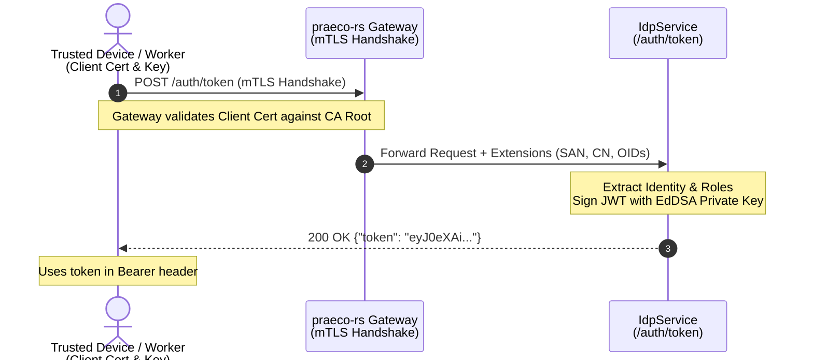
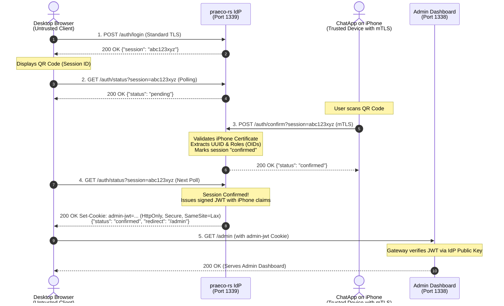

# Building a Zero-Trust mTLS Identity Provider (IdP) in Rust with Praeco

*Ditching passwords: How to bridge strict mTLS device authentication with frictionless web browser access using a custom Identity Provider.*

---

If you’ve been following my previous 11 articles on **Praeco**, you know that it is a highly concurrent, feature-rich API Gateway and Reverse Proxy built in Rust. Up until now, we’ve heavily focused on **Mutual TLS (mTLS)** as the ultimate zero-trust authentication mechanism. 

mTLS is fantastic for device-to-server communication. In our practical example—a secure, end-to-end encrypted iOS **ChatApp**—every mobile device is provisioned with a unique client certificate. The Praeco gateway authenticates every single gRPC request by cryptographically verifying this certificate, completely eliminating the need for passwords or bearer tokens.

But this strict mTLS architecture introduces a massive UX hurdle: **How do you securely log into a web-based Admin Dashboard?**

Web browsers are notoriously clunky when it comes to managing and selecting client certificates. Forcing admins to manually install `.p12` certificates into their browser keystores is a support nightmare. We needed a way to keep the zero-trust mTLS foundation without ruining the web experience.

The solution? We built a native **Identity Provider (IdP)** directly into Praeco. 

## Two Ways to Authenticate: The mTLS to JWT Bridge

The Praeco IdP acts as a bridge, translating strict cryptographic mTLS identities into portable JSON Web Tokens (JWTs) that standard web applications can easily consume. It supports **two distinct authentication flows**:

### Method 1: Direct mTLS Authentication (The Device Flow)
This method is incredibly straightforward. A trusted device (like a backend worker or a specialized client) that already possesses a valid mTLS certificate simply makes a `POST` request to the IdP (`/auth/token`). 

The IdP validates the certificate, extracts the identity and roles, and immediately returns a signed JWT. This is perfect for downstream services or legacy API clients that understand `Authorization: Bearer <token>` but don't speak mTLS natively.

```bash
# Request a JWT directly using mTLS client certificates
curl -X POST https://localhost:1339/auth/token \
  --cert client_certs/device.crt \
  --key client_certs/device.key \
  --cacert server_certs/ca.crt
  
# Response: {"token":"eyJ0eXAi...<JWT_TOKEN>..."}
```



### Method 2: Cross-Device Login (The QR Code Flow)
But what happens when the user is on an untrusted device (like a web browser) that *doesn't* have a certificate? 

For this, the IdP leverages the trusted, certificate-bearing mobile app to securely authorize a temporary session on the untrusted device. Once authorized, the IdP issues a signed JWT to the browser. This creates a seamless **Cross-Device Login Flow** (often seen in modern apps like WhatsApp Web or Discord).

### The User Experience: The QR Code Flow

From a user's perspective, this complex cryptographic handshake is completely invisible. It boils down to a simple, familiar QR code scan. Here is the UX flow and how it looks in our practical example, the ChatApp.

#### 1. Session Initiation & Display (The Web Browser)
The user opens the Admin Dashboard in their desktop browser. Because they aren’t authenticated, Praeco redirects them to the IdP login page. The browser requests a temporary session and renders the returned `session_id` as a large QR code on the screen.

> **[PLACEHOLDER FOR IMAGE 1]**
> `<!-- INSERT IMAGE: Desktop browser showing the QR code on the login page -->`
> *Caption: The desktop browser displaying the generated QR code, waiting for the user to scan it.*

Behind the scenes, the browser initiated the session like this:
```bash
# Request a new session_id
curl -s -X POST https://localhost:1339/auth/login
# Response: {"session":"abc123xyz"}
```
And starts continuously polling for confirmation:
```bash
curl -s "https://localhost:1339/auth/status?session=abc123xyz"
# Response: {"status":"pending"}
```

#### 2. Scanning & Cryptographic Confirmation (The Mobile App)
The user opens their trusted ChatApp on their iPhone and uses the built-in QR scanner to scan the code displayed on the desktop screen.

> **[PLACEHOLDER FOR IMAGE 2]**
> `<!-- INSERT IMAGE: iPhone app showing the camera scanning the QR code / confirming login -->`
> *Caption: The trusted ChatApp scanning the QR code and prompting the user to confirm the login.*

Once the user confirms, the mobile app sends an authorization request to the IdP. **Crucially, this request is made over an mTLS connection using the iPhone's securely stored client certificate.** 

Praeco extracts the user's identity (UUID) and Admin/Seller roles directly from the certificate during the TLS handshake, and attaches those cryptographically verified claims to the pending session.

```bash
# The trusted mobile app confirms the session using its mTLS cert
curl -s -X POST "https://localhost:1339/auth/confirm?session=abc123xyz" \
  --cert client_certs/device.crt \
  --key client_certs/device.key \
  --cacert server_certs/ca.crt
```

#### 3. Token Issuance & Redirection (The Web Browser)
On the next poll interval, the desktop browser sees that the session is confirmed. The Praeco IdP generates a JWT signed with its own private EdDSA key, embedding the roles and UUID extracted from the mobile certificate. 

To ensure maximum security, the JWT is returned as an `HttpOnly`, `Secure`, and `SameSite=Lax` cookie. 

```http
< HTTP/1.1 200 OK
< set-cookie: admin-jwt=eyJ0eXAi...; HttpOnly; Secure; SameSite=Lax; Path=/; Max-Age=28800
< content-type: application/json

{"status":"confirmed","redirect":"/admin"}
```

Instantly, the QR code disappears, and the browser redirects the user into the fully authenticated Admin Dashboard.

> **[PLACEHOLDER FOR IMAGE 3]**
> `<!-- INSERT IMAGE: Desktop browser showing the fully logged-in Admin Dashboard -->`
> *Caption: Success! The user is securely logged into the dashboard without ever typing a password.*

#### Full Sequence Overview for Cross-Device Login


### The Cookie Strategy: Hardening Web Security

A crucial design decision in Praeco's IdP is **how the JWT is delivered to and stored by the browser**.

In many modern Single Page Applications (SPAs), developers store tokens in `localStorage` or `sessionStorage` and manually attach them to every request via an `Authorization: Bearer <token>` header. While easy to implement, **storing sensitive JWTs in LocalStorage is a well-known security risk** because any Cross-Site Scripting (XSS) vulnerability allows malicious scripts to extract the token and impersonate the user.

Praeco avoids this entirely by packaging the issued JWT into a hardened HTTP cookie:

```http
Set-Cookie: admin-jwt=eyJ0eXAiOiJKV1QiLCJhbGciOiJFZERTQSJ9...; HttpOnly; Secure; SameSite=Lax; Path=/; Max-Age=28800
```

This brings three essential security benefits out of the box:

1. **`HttpOnly` (XSS Mitigation):** 
   The browser forbids client-side JavaScript (`document.cookie`) from reading the cookie. Even if an attacker manages to inject malicious JavaScript into the dashboard, they **cannot read or steal the JWT**.
   
2. **`Secure` (MitM Prevention):** 
   The cookie is strictly restricted to HTTPS encrypted connections, preventing token leakage over insecure Wi-Fi networks.

3. **`SameSite=Lax` (CSRF Protection):** 
   The browser will not send the cookie during cross-origin requests triggered by external, malicious websites, protecting against Cross-Site Request Forgery (CSRF).

4. **Zero-Code Frontend Handling:** 
   Because browsers automatically attach cookies to same-origin requests, frontend code doesn't need complex token interceptors, refresh timers, or header injection logic. 

#### How Praeco Validates the Cookie at the Gateway
When the browser navigates to `/admin` or makes an API call to `/api/GetUsers`, Praeco's `JwtAuth` middleware intercepts the request:
- It first checks for a standard `Authorization: Bearer <token>` header.
- If absent, it automatically checks the configured `cookie_fallback = "admin-jwt"`.
- It verifies the EdDSA cryptographic signature against the IdP's public key.
- If valid, the gateway extracts the verified User UUID and Roles, allowing the request through to the backend service.

## Configuring the IdP in Praeco

Because the IdP is a native middleware layer in Praeco, setting it up is entirely configuration-driven. Here is a simplified version of the TOML configuration used in our ChatApp environment.

### 1. The IdP Server
We define a new server block running on port `1339`. Notice that `authentication = "OptionalClientCert"` is used so that browsers can connect without a certificate, but mobile apps can still present theirs during the `/auth/confirm` step.

```toml
[[Server]]
    name = "chatapp_idp"
    ip = "0.0.0.0"
    port = 1339
    protocol = "https"
    authentication = "OptionalClientCert"
    service = "Idp"
    
    # Map OIDs from the mTLS certificate to human-readable roles
    [Server.oid_mapping]
        "1" = "Admin"
        "2" = "Seller"
    
    [Server.IdpParams]
        jwt_private_key = "/certs/idp_private.pem"
        token_expiry_seconds = 28800 # 8 hours
        session_ttl_seconds = 120
        cookie_name = "admin-jwt"
        redirect_after_login = "https://localhost:1338/admin"
```

### 2. The Admin Server (Consuming the JWT)
On the actual Admin Dashboard server (Port `1338`), we enable the `JwtAuth` layer. We provide it with the IdP's public key so it can cryptographically verify incoming requests. 

If a request arrives without a valid JWT cookie, Praeco intercepts it and automatically redirects the user to the IdP login page.

```toml
[[Server]]
    name = "chatapp_admin"
    port = 1338
    protocol = "https"
    authentication = "None"
    
    [Server.Layers]
        enabled = ["JwtAuth", "SecurityHeaders", "Proxy"]

    [Server.Layers.JWT]
        jwt_public_keys = ["/certs/idp_public.pem"]
        cookie_fallback = "admin-jwt"
        redirect_on_failure = "https://localhost:1339/auth/login_page"
```

## Conclusion

By integrating an Identity Provider directly into the API Gateway, we’ve achieved the best of both worlds. We maintain a hardened, zero-trust infrastructure relying on cryptographic mTLS certificates for all devices, while providing a frictionless, passwordless web login experience for our administrators.

No databases to query for passwords, no SMS OTPs to send, and no compromised credentials. Just pure, mathematical trust bridged elegantly to the web.

*This was part 12 in the series on building Praeco. In the next article, we’ll dive into...*
